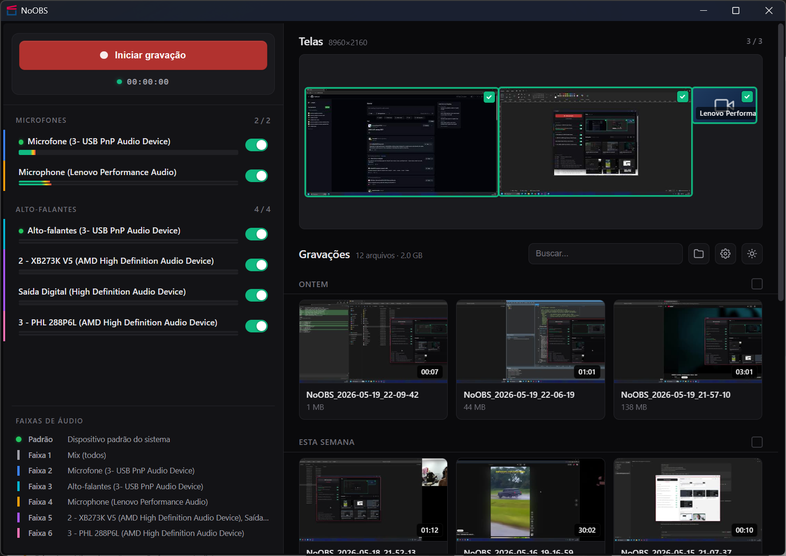
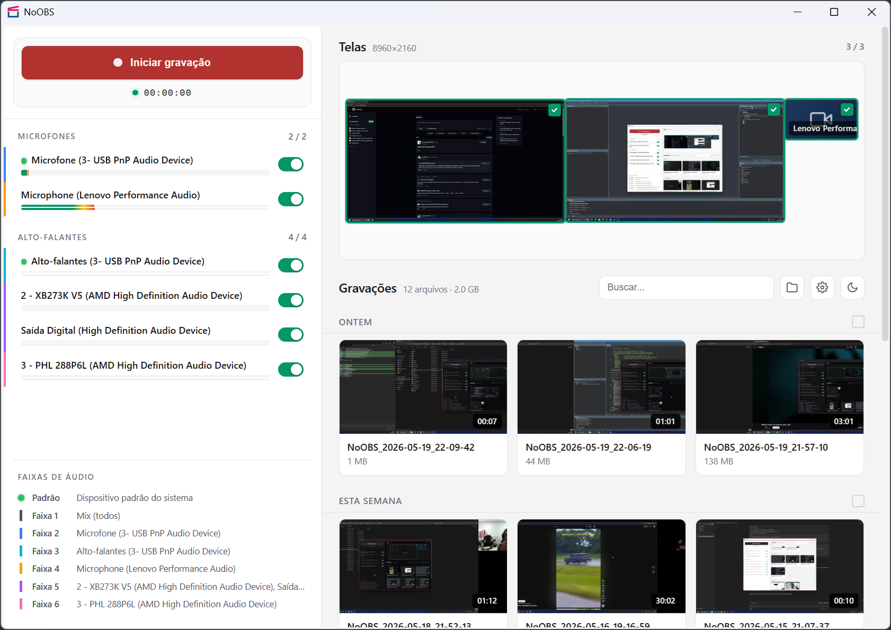

# NoOBS

  
  

Gravador de tela simples e direto, sem complicação. Uma interface
pensada pra ser fácil de usar que aproveita toda a potência do OBS
— você não precisa instalar nem configurar o OBS, tudo já vem pronto.
Só abrir e gravar.

---

## Recursos

### Gravação
| Recurso | Descrição |
|---|---|
| Captura multi-monitor | Grava todos os seus monitores ao mesmo tempo em um único arquivo, lado a lado |
| Webcam | Detecta suas webcams automaticamente e permite adicionar na gravação |
| Áudio separado por dispositivo | Cada microfone e alto-falante em faixas independentes, facilitando edição depois |
| Gravação só de áudio | Se nenhum monitor ou webcam estiver selecionado, o áudio ainda é gravado |
| Detecção em tempo real | Reconhece quando você conecta ou desconecta microfones, alto-falantes, monitores e webcams |
| Codec automático | Detecta sua placa de vídeo e usa o melhor encoder disponível (AV1 → HEVC → H.264 → x264) |
| Faixa "Mix" + isoladas | Faixa 1 é o mix de tudo; faixas 2–6 individuais por dispositivo (até 6 no total) |
| Dispositivo padrão preservado | O microfone e alto-falante padrão do Windows sempre ficam em faixas individuais quando possível |

### Interface
| Recurso | Descrição |
|---|---|
| Tema claro/escuro | Alterna entre os dois temas |
| Preview ao vivo | Miniaturas dos monitores e webcams atualizando a 2 FPS, identifica facilmente o que será gravado |
| Legenda de faixas de áudio | Mostra qual dispositivo está em qual faixa do vídeo, com cores distintas |
| Indicador de dispositivo padrão | Bolinha verde nos dispositivos definidos como padrão no Windows |
| Notificações nativas | Avisa no Windows quando inicia/para gravação (se o app estiver minimizado) |

### Atalhos e automação
| Recurso | Descrição |
|---|---|
| Atalho global configurável | Padrão: tecla `Pause`. Configurável com até 4 teclas (Ctrl+Shift+Alt+G, etc.) |
| Bandeja do sistema | Ícone próximo ao relógio com menu para iniciar/parar gravação, abrir e fechar |
| Iniciar com Windows | Abre minimizado na bandeja ao logar, gravação fica pronta no atalho global |
| Minimizar ao gravar | Opção pra esconder a janela automaticamente quando a gravação começa |
| Fechamento inteligente | Botão [X] minimiza pra bandeja se estiver gravando ou se "iniciar com Windows" estiver ativo |

### Reprodução e gerenciamento
| Recurso | Descrição |
|---|---|
| Player embutido | Assista suas gravações direto no app, com zoom e controles de reprodução |
| Volume por faixa | Ajuste o volume de cada microfone e alto-falante separadamente ao assistir |
| Informações do vídeo | Detalhes técnicos da gravação: resolução, duração, codec, bitrate, faixas de áudio |
| Lista com miniaturas | Cards com thumbnail, duração e tamanho de cada gravação |
| Busca e gerenciamento | Filtrar, renomear, excluir em lote |
| Compatível com editores | MKV padrão com metadata correta de nome de faixa — abre direto no DaVinci, Premiere, etc. |

---

## Instalação

Baixe a versão mais recente em [Releases](https://github.com/e-delphi/NoOBS/releases).

O instalador oferece a opção **Iniciar com o Windows** durante a
instalação — marcado por padrão, faz o NoOBS subir minimizado na
bandeja ao logar.

---

## Terceiros

Este software utiliza os seguintes componentes open-source:

- **OBS Studio** — GPL v2+ — https://github.com/obsproject/obs-studio
- **FFmpeg** — LGPL v2.1+ / GPL v2+ — https://ffmpeg.org
- **WebView2** — Microsoft Software License — UI HTML embutida via runtime do Edge
