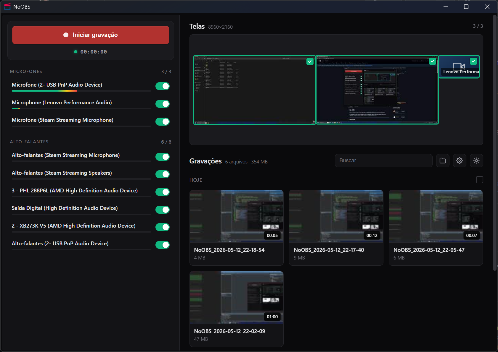

# NoOBS

Gravador de tela simples e direto, sem complicação. Uma interface
pensada pra ser fácil de usar que aproveita toda a potência do OBS
— você não precisa instalar nem configurar o OBS, tudo já vem pronto. Só abrir e gravar.

---

## Recursos

| Recurso | Descricao |
|---|---|
| Captura multi-monitor | Grava todos os seus monitores ao mesmo tempo em um unico arquivo, lado a lado |
| Webcam | Detecta suas webcams automaticamente e permite adicionar na gravacao |
| Audio separado por dispositivo | Grava cada microfone e alto-falante em faixas independentes, facilitando a edicao depois |
| Qualidade automatica | Detecta sua placa de video e usa a melhor configuracao disponivel |
| Gravacao somente audio | Se nenhum monitor ou webcam estiver selecionado, o audio ainda sera gravado |
| Atalho global | Ctrl+Shift+F9 inicia/para a gravacao de qualquer lugar do sistema |
| Detecta dispositivos | Reconhece automaticamente quando voce conecta ou desconecta microfones, alto-falantes e monitores |
| Tema claro/escuro | Alterna entre tema claro e escuro |
| Player embutido | Assista suas gravacoes direto no app, com zoom e controles de reproducao |
| Volume por faixa | Ajuste o volume de cada microfone e alto-falante separadamente ao assistir |
| Informacoes do video | Mostra detalhes tecnicos da gravacao como resolucao, duracao e qualidade |
| Gerenciamento de gravacoes | Lista suas gravacoes com miniatura, busca, renomeacao e exclusao em lote |

---

## Instalacao

Baixe a versao mais recente em [Releases](https://github.com/e-delphi/NoOBS/releases).

---

## Terceiros

Este software utiliza os seguintes componentes open-source:

- **OBS Studio** — GPL v2+ — https://github.com/obsproject/obs-studio
- **FFmpeg** — LGPL v2.1+ / GPL v2+ — https://ffmpeg.org
