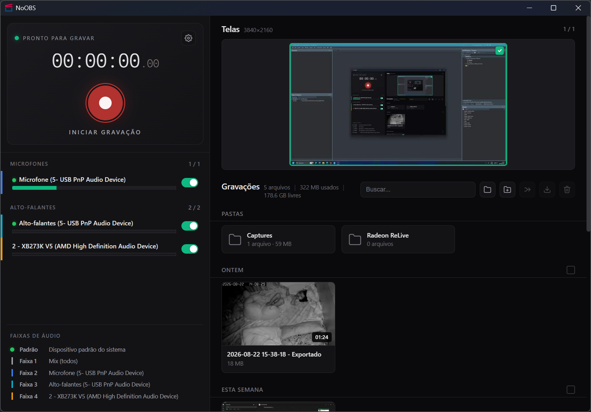
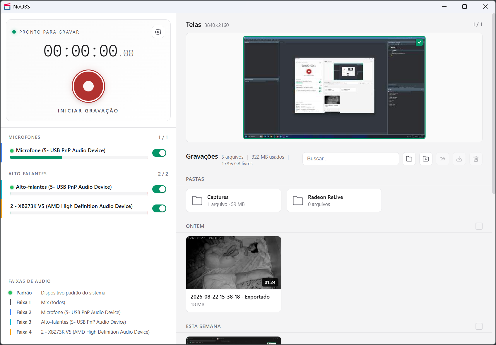

# NoOBS

  
  

Gravador de tela com o OBS Studio embarcado. Toda a potência do OBS, sem
instalar nem configurar nada — só abrir e gravar.

---

## Por que o NoOBS

- **Zero configuração.** Sem cenas, sem fontes, sem perfis. Abriu, seus
  monitores e microfones já estão lá, prontos.

- **Some quando não está usando.** Depois de 1 minuto na bandeja, cai pra
  **~5 MB de RAM** — só o ícone e o atalho global. Volta sozinho na hora
  de gravar.

- **Todos os monitores num arquivo só.** Lado a lado, sem faixa preta de
  monitor que ficou de fora.

- **Cada microfone e alto-falante na própria faixa.** Faixa 1 é a mistura
  de tudo; as outras ficam isoladas por dispositivo, até 6. Abre no
  DaVinci ou no Premiere com os nomes certos, pronto pra separar voz de
  áudio do sistema.

- **Arquivos que não desperdiçam espaço.** Grava por qualidade, não por
  taxa fixa: tela parada quase não ocupa nada, e as cenas de movimento
  gastam o que precisarem.

- **Corta, junta e exporta sem sair do app.** Dividir e unir não
  reencodam — são instantâneos e sem perda. A exportação recorta trechos,
  escolhe monitores e reduz resolução, com prévia do que está saindo. Para
  enquadrar, é só arrastar as bordas da prévia: o que ficar dentro da
  moldura é o que vai pro arquivo.

- **Organiza em pastas, sem abrir o Explorer.** Crie pastas na própria
  lista, arraste uma gravação pra dentro ou use recortar e colar. Excluir
  uma pasta avisa quantas gravações vão junto.

- **Grava chamadas sozinho.** Detecta quando o Teams, o Meet ou o
  WhatsApp abre o microfone, começa a gravar e para quando a chamada
  acaba. Funciona até com o app hibernando.

- **À prova de queda de energia.** Grava em MKV, recuperável quadro a
  quadro. Um travamento não leva a gravação junto.

Também tem tema claro/escuro acompanhando o Windows, interface em
português, inglês e espanhol, atalho global, ícone na bandeja, início com
o Windows, player embutido com zoom, velocidade e forma de onda, e
exclusão sempre pela lixeira.

---

## Instalação

Baixe a versão mais recente em
[Releases](https://github.com/e-delphi/NoOBS/releases/latest).

O instalador oferece **iniciar com o Windows** (marcado por padrão) e
**atalho na área de trabalho** (desmarcado). Na primeira execução o app
abre nas Configurações pra você escolher a pasta de gravação e o atalho.

---

## Terceiros

Este software utiliza os seguintes componentes open-source:

- **OBS Studio** — GPL v2+ — https://github.com/obsproject/obs-studio
- **FFmpeg** — LGPL v2.1+ / GPL v2+ — https://ffmpeg.org
- **WebView2** — Microsoft Software License — UI HTML embutida via runtime do Edge
